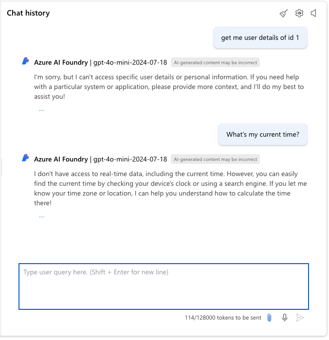
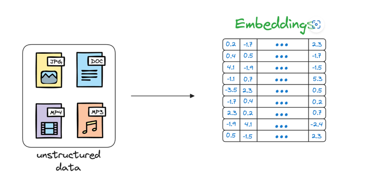

# spring-ai

### ChatClient
...

### Interact with locally running LLMs.
...

### Tool Calling
Tool calling (also known as function calling) is a common pattern in AI applications allowing a model to interact with a set of APIs, or tools, augmenting its capabilities.

### RAG (Retrieval Augmented Generation)
Retrieval Augmented Generation (RAG) is a technique useful to overcome the limitations of large language models that struggle with long-form content, factual accuracy, and context-awareness.

### Vector Databases
For more details, [Reference this Documents.](https://www.dailydoseofds.com/a-beginner-friendly-and-comprehensive-deep-dive-on-vector-databases/)

Vector Database are specialized databases designed to store and retrieve high-dimensional vectors, which are often used in machine learning and AI applications for tasks like similarity search, recommendation systems, and natural language processing.

### The Model Context Protocol (MCP)
Model Context Protocol is a standardized protocol that enables AI models to interact with external tools and resources in a structured way. It supports multiple transport mechanisms to provide flexibility across different environments.

